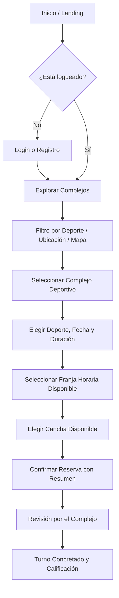

# Rent Now - Aplicación Web Cliente (Rent-Now-App)

> Aplicación web responsive (Mobile-First / PWA-ready) de **Rent Now** diseñada para que deportistas y clientes puedan descubrir complejos deportivos, explorar canchas en un mapa interactivo con geolocalización, consultar disponibilidad en tiempo real, reservar turnos y calificar sus experiencias.

---

## 📋 Tabla de Contenidos
- [Características Principales](#-características-principales)
- [Stack Tecnológico](#-stack-tecnológico)
- [Arquitectura del Proyecto](#-arquitectura-del-proyecto)
- [Requisitos Previos](#-requisitos-previos)
- [Instalación y Ejecución Local](#-instalación-y-ejecución-local)
- [Ejecución con Docker](#-ejecución-con-docker)
- [Variables de Entorno y Configuración](#-variables-de-entorno-y-configuración)
- [Estructura del Repositorio](#-estructura-del-repositorio)
- [Flujo de Reserva del Usuario](#-flujo-de-reserva-del-usuario)

---

## ✨ Características Principales

### 🏟️ Descubrimiento de Complejos Deportivos
- **Mapa Interactivo con Geolocalización**: Detecta la posición actual del usuario mediante HTML5 Geolocation y busca complejos deportivos en un radio configurable usando hashes geoespaciales con `geofire-common`.
- **Filtros Avanzados**: Búsqueda por deporte (Fútbol, Pádel, Básquet, Tenis, etc.) y selector dinámico de Provincia y Ciudad con autocompletado conectado a la API de datos geoespaciales de Argentina.
- **Tarjetas de Complejo con Valoraciones**: Muestra imágenes de portada, tipos de cancha disponibles, dirección y puntuación promedio de usuarios de la comunidad.

### 📅 Reserva y Disponibilidad en Tiempo Real
- **Configuración Dinámica de Turno**: Selección de tipo de cancha, fecha y duración (1h, 1:30h, 2h).
- **Selector de Franjas Horarias**: Carrusel horizontal interactivo que muestra horarios libres vs no disponibles en tiempo real.
- **Detalle de Canchas**: Ficha técnica con tipo de superficie/piso, infraestructura (techada, iluminación, césped sintético), capacidad de jugadores y precio por turno.
- **Confirmación con Recibo Digital**: Resumen detallado con fecha, horario, total calculado, contacto del complejo y método de pago en el local.

### ⭐ Perfil, Historial y Valoraciones
- **Panel de "Mis Reservas"**: Visualización del estado del turno con badges de color (`CONFIRMADA`, `PENDIENTE`, `CANCELADA`, `FINALIZADA`).
- **Línea de Tiempo de Estados**: Historial y auditoría de cambios de estado del turno (solicitud, confirmación, motivo de cancelación si corresponde).
- **Cancelación Segura**: Opción de cancelación con límite de hasta 2 horas antes del inicio del turno.
- **Calificación y Reseñas**: Sistema de estrellas (1 a 5) y comentarios para canchas y complejos utilizados.
- **Centro de Notificaciones**: Notificaciones en tiempo real vía Firestore sobre turnos confirmados, cancelados o finalizados listos para valorar.

---

## 🛠️ Stack Tecnológico

| Capa | Tecnología | Versión |
| :--- | :--- | :--- |
| **Framework UI** | React | `^18.3.1` |
| **Build Tooling** | Vite | `^5.4.3` |
| **Biblioteca de Componentes** | Material UI (MUI) | `^5.16.7` |
| **Motor de Estilos** | Emotion | `^11.13.3` |
| **Ruteo SPA** | React Router DOM | `^6.26.2` |
| **Backend REST API** | Java 21 + Spring Boot 3.3 | `3.3.3` |
| **Base de Datos** | PostgreSQL (Docker) | `16-alpine` |
| **Autenticación** | Spring Security + JWT Stateless | `0.12.6` |
| **Mapas & Geocodificación** | `@react-google-maps/api` | `^2.19.3` |
| **Formularios** | Formik | `^2.4.6` |
| **Manejo de Fechas** | Moment.js | `^2.30.1` |
| **Alertas & Modales** | SweetAlert2 | `^11.14.0` |
| **Contenedorización** | Docker (Multi-stage) + Nginx Alpine | `Node 20` / `Nginx Alpine` |


---

## 🚀 Instalación y Ejecución Local

### 1. Clonar el repositorio y acceder a la rama de refactor:
```bash
git clone https://github.com/facuvillard/Rent-Now-App.git
cd Rent-Now-App
git checkout feature/full-refactor
```

### 2. Instalar dependencias:
```bash
npm install
```

### 3. Iniciar el servidor de desarrollo:
```bash
npm run dev
```
La aplicación estará disponible en: **`http://localhost:5174`** (o el puerto asignado por Vite con recarga instantánea HMR).

### 4. Compilar para producción:
```bash
npm run build
```
Genera los bundles estáticos optimizados con chunk splitting en el directorio `dist/`.

---

## 🐳 Ejecución con Docker

El proyecto cuenta con un `Dockerfile` multi-stage optimizado que compila la aplicación en un contenedor de Node 20 y sirve los artefactos estáticos con Nginx Alpine con compresión gzip y fallback para Single Page Application.

### Ejecutar con Docker Compose:
```bash
docker compose up --build -d
```

- **URL de Producción:** **`http://localhost:3001`**
- **Healthcheck:** `http://localhost:3001/health`

### Detener el contenedor:
```bash
docker compose down
```

### Compilar y correr solo con Docker CLI:
```bash
# Construir la imagen
docker build -t rentnow-app:latest .

# Ejecutar el contenedor
docker run -d --name rentnow-app-prod -p 3001:80 rentnow-app:latest
```

---

## ⚙️ Variables de Entorno y Configuración

El proyecto se conecta a Firebase y a Google Maps:
- **Firebase Project:** `rent-now-13046`
- **Configuración Firebase:** `src/firebase.js`
- **Clave de Google Maps:** `src/constants/apiKeys.js`
- **Puerto configurable en Docker:** variable `PORT` en `.env` (por defecto `3001`).

---

## 📂 Estructura del Repositorio

```text
Rent-Now-App/
├── public/                     # Assets públicos e íconos PWA
│   ├── rentnow.ico
│   ├── manifest.json
│   └── robots.txt
├── src/
│   ├── api/                    # Servicios de API y Cloud Functions
│   │   ├── auth.js             # Autenticación, registro y reseteo
│   │   ├── complejos.js        # Búsqueda geoespacial y filtros
│   │   ├── espacios.js         # Canchas y horarios disponibles
│   │   ├── geoApi.js           # API de provincias y localidades
│   │   ├── reservas.js         # Creación y cancelación de reservas
│   │   └── usuarios.js         # Notificaciones en tiempo real
│   ├── assets/                 # Imágenes, logos y badges de deportes
│   ├── Auth/                   # Contexto de autenticación y estado de sesión
│   ├── components/
│   │   ├── Complejos/          # Vista de mapa interactivo y listado
│   │   │   ├── ComplejoDetail/ # Perfil del complejo, canchas, fotos y opiniones
│   │   │   ├── ComplejosList/  # Listado filtrable por deporte y ciudad
│   │   │   └── ComplejosMap/   # Google Maps con marcadores e info windows
│   │   ├── Espacios/           # Detalle de cancha individual
│   │   ├── Landing/            # Página de aterrizaje moderna
│   │   ├── Layout/             # Navbar, drawer móvil y notificaciones
│   │   ├── Login/              # Inicio de sesión y datos complementarios
│   │   ├── RegisterUser/       # Registro de nuevos clientes
│   │   ├── Reservas/           # Confirmación de turno y mis reservas
│   │   └── utils/              # Diálogos, alertas y wrappers de links
│   ├── constants/              # Rutas, claves de API, tipos de espacios
│   ├── App.js                  # Ruteo principal con React Router v6
│   ├── firebase.js             # Inicialización de Firebase v10
│   ├── index.js                # React 18 createRoot y ThemeProvider
│   └── theme.js                # Tema MUI 5 unificado (colores corporativos)
├── Dockerfile                  # Multi-stage build (Node 20 + Nginx)
├── docker-compose.yml          # Orquestación de contenedores (puerto 3001)
├── nginx.conf                  # Nginx con soporte SPA y gzip
├── vite.config.js              # Configuración de Vite 5 y aliases
├── index.html                  # HTML entry point de Vite
└── README.md                   # Documentación técnica completa
```

---

## 🔄 Flujo de Reserva del Usuario



---

## 📄 Licencia
Este proyecto es propiedad de Rent Now. Todos los derechos reservados.
